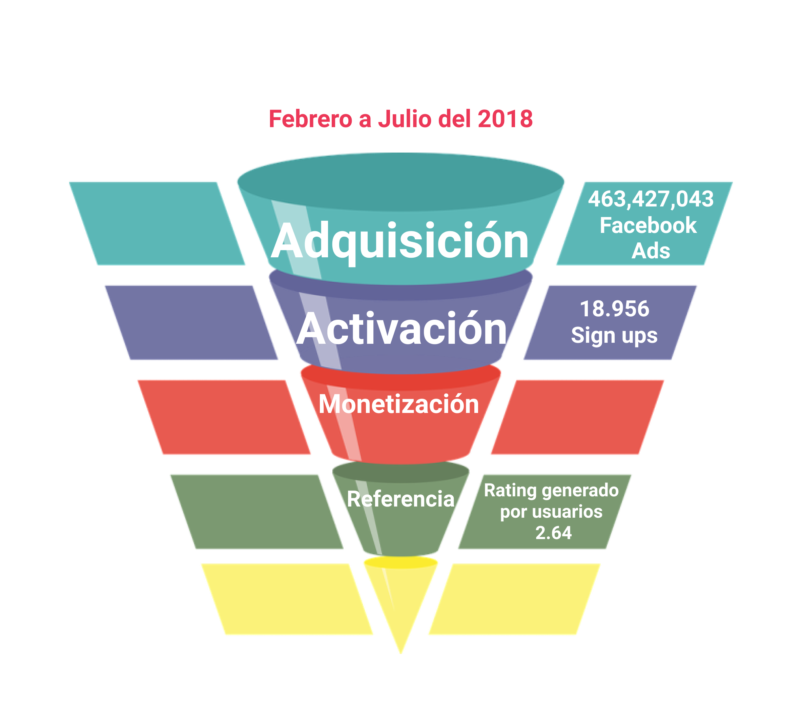
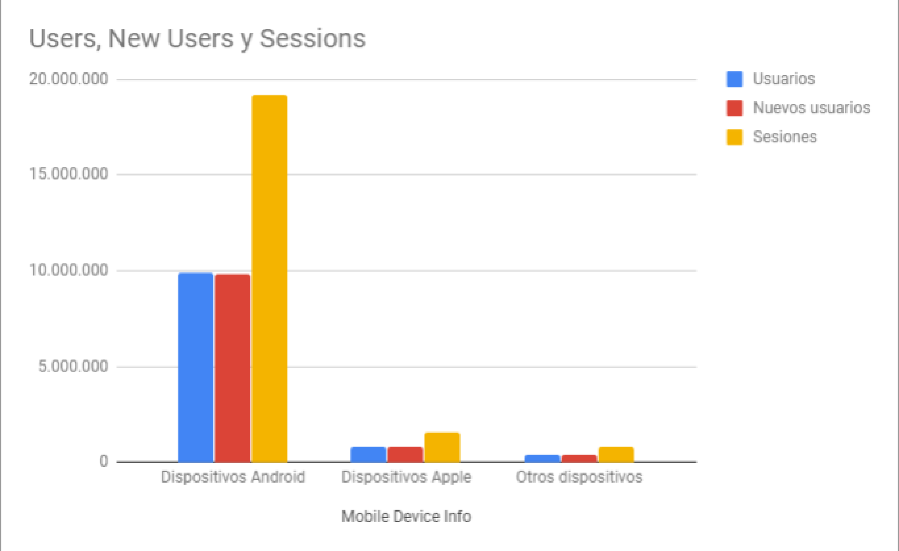

# Rediseño de aplicación bancaria

## Objetivos iniciales del proyecto

El banco más importante del país me ha encomendado, como UX designer, el proyecto de rediseño 
de su nueva aplicación móvil, donde sus usuari@s pueden visualizar sus gastos mensuales y llevar
a cabo metas de ahorro.  Es necesario llevar a cabo un diagnóstico del estado actual de la aplicación, 
evaluar su desempeño y proponer los cambios necesarios para optimizar el producto. 

## Problemas encontrados

El proceso de rediseño de esta aplicación implica el análisis del trabajo previo, el cual inevitablemente
tendrá áreas de mejora a ser resueltas con una nueva propuesta e iteración continua de la mano del cliente
y los usuarios. 

Para llevar a cabo este proceso es primordial tener el feedback de los usuarios, identificar los cambios 
y mejoras priorizando aquellos que agregan mayor valor a la experiencia de los usuarios y empatan con los 
objetivos del cliente. 

Después del análisis heurístico realizado a la landing page y al flujo actual de la aplicación desarrollada en 
iOS, así como el análisis llevado a cabo sobre la data proporcionada, se identifican los **siguientes problemas**: 

* Durante los 6 meses que la aplicación ha estado disponible en el mercado el porcentaje de conversión entre la 
fase de adquisición (por medio de Facebook Ads) y la fase de activación (usuarios que han descargado la app y se 
han registrado para hacer uso) se traduce en un 0.0040903%. Lo cual sugiere lo **poco recomendable** que sería 
**duplicar el presupuesto destinado a generar anuncios de Facebook**. En cambio **se sugiere segmentar los anuncios 
de acuerdo al público que se intenta adquirir, especificando en los anuncios el sistema operativo con el cual opera
la aplicación y las funcionalidades que ésta contiene**. 

He identificado las **fases de activación y recomendación** como aquellas **prioritarias** para cumplir con los objetivos 
propuestos por el negocio, es decir, **fidelizar a sus cuentahabientes y fomentar el ahorro por medio de la aplicación**.

## Análisis heurístico

### Landing Page
El anuncio de Facebook lleva al usuario a la Landing Page de la aplicación, misma que contiene 2 CTA, el primero 
"Descárgala ahora" lo lleva a un formulario de llenado con la instrucción "Déjanos tus datos y recibe el link de 
descarga." Mismo que no se hace llegar al usuario, en cambio le redirecciona a una página de agradecimiento y
posteriormente a la App Store donde el usuario podrá descargar la aplicación. 

Hasta este punto **no existe un onboarding claro para el usuario, no se le informa en qué consiste la aplicación
y qué valor podría aportarle su uso.** Sobre el **branding, no se encuentran elementos diferenciadores de la 
identidad del banco al que pertenece la aplicación o de una experiencia distintiva que se sostenga a lo 
largo de la aplicación.** 

Verbalizaciones obtenidas durante el testeo con usuarios:
- *"Me gusta que la landing sea muy sencilla, que sea muy fácil de detectar, los colores son muy de banco,* 
   *van de acuerdo al banco."*
- *"¿Es en esta parte o en la de arriba? Veo que tienes dos veces el mismo botón para hacer la operación,* 
   *y el de arriba me dirige abajo."*
- *"Me gusta más que las cosas que son la función de la aplicación las vea apenas entre y eso no está.* 
   *Me invitas a descargarla pero no   me das el cómo hacerlo, controla tu dinero, pero algo que me diga de* 
   *una vez qué es lo chingonsísimo de una aplicación y por qué la tengo que bajar."* 

### App Store  
Dentro de la App Store nos encontramos con un eslogan distinto al usado dentro de la Landing Page, los colores y 
el logo de la aplicación son consistentes. Aunque es la séptima aplicación financiera, su rating es de 2.64 
estrellas lo cual denota una **falta de satisfacción con el producto, ya que este rating se basa en la calificación 
generada por cada usuario, por lo que me parece prioritario mejorar este rating** y cambiar la edad de uso sugerida
a 18+, ya que por el momento se encuentra en personas mayores de 9 años. Hasta este punto no ofrece más información
de la ya mostrada en la landing page, el onboarding no queda claro para los usuarios.

Verbalizaciones obtenidas durante el testeo con usuarios:
- *"Me estás dirigiendo a la app de la aplicación. Uso un teléfono de gama media, Android."*
- *"¿Si no tengo cuenta no importa? ¿Es exclusiva para Iphone?"*

### Sign Up
Dentro del sign up, de acuerdo al testeo realizado con usuarios, es necesario **mejorar la visibilidad del estado 
del proceso, prevenir posibles errores, reconocer y recuperarse de errores, y ofrecer ayuda al usuario** 
sobre lo que debe hacer en cada etapa del sign up mejorando los formularios y las instrucciones de llenado, 
así como la acción necesitada en uno de los pasos. 

Verbalizaciones obtenidas durante el testeo con usuarios:
- *"¿No hay un paso antes de hacer un registro? ¿O cómo sabe tu aplicación que soy un usuario del banco?* 
     *Te piden cierto registro en el banco para solo llegar e ingresar ciertos datos."*
- *"Agregar foto, está bien pero nunca lo hago, no le veo sentido para qué el banco lo tiene, suficientes* 
   *datos personales tienen, no veo qué uso puedan darle."*
- *"Creo que podría ser más inseguro que la felicidad que tendría el poner mi foto allí."*
- *"Me llegó un código en mi teléfono y debería salir aquí mismo. No había visto la letrita."*
- *"¿Número de cuenta es mi CLABE o qué? ¿Cuál cuenta, la de la aplicación o de mi cuenta bancaria?* 
   *¿Cómo sabe qué banco es?"* 
- *"¿Me llegó un mail de confirmación? Me gustaría, es mi cuenta bancaria, no tengo problema en meter* 
    *más mis datos, pero es la primera vez que uso algo así."*
- *"A lo mejor otra tipografía, se pierde un poco, yo soy muy ciega. No quiero poner mi foto, hacerlo más tarde.*
   *Eso de la huella me gusta, yo que soy muy paranoica, el que puedas poner tu huella para acceder a tu cuenta* 
   *me da más seguridad y confianza. Yo sé que no todos los teléfonos lo tienen, pero que tengan para identificarla* 
   *es un punto extra, da mucha confianza."*
- *"No sé cómo se llama esta app."*
- *"¿Por qué otra vez me dice que acepto los términos, son distintos cada vez? No me queda claro."* 
- *"No me parece ese avatar porque tiene género, o que lo tuviera de acuerdo a mi género, no me lo pide entonces*
   *no sé cómo va a saber."* 
- *"Me gustaría que todos los campos tuvieran datos dummie para saber cómo tiene que ser. Quisiera una ayuda* 
   *que me dijera cómo tiene que ser la contraseña, que me diga de qué tiene que estar hecha esa contraseña."* 
- *"Me abre el carrete, no pide permiso para acceder a mi carrete ¿puedo elegir la que sea? Si no lo lleno* 
   *ahorita espero que más adelante pueda hacerlo de manera fácil, vamos a hacerlo después, ah no puedo,* 
   *porque en tu flujo de navegación no puedo arrepentirme."*
- *"¿Llené mi nombre? ¿De dónde lo saca? ¿De sus datos de cuenta?"*

### Patalla de inicio. HOME
Muestra un mensaje de bienvenida con el nombre del usuario, una imagen de la tarjeta del mismo ocupa 3/4 
de la pantalla, una campana en la esquina superior derecha anuncia las notificaciones de la app, el saldo 
disponible se encuentra abajo de la tarjeta sin especificar la moneda o un desglose del mismo. 
En la parte inferior se muestra un **botón con tres puntos que da acceso al menú con los distintos apartados
de la aplicación, mismos que no conoce el usuario**, en la navbar se encuentra un menú hamburguesa que 
incluye la foto del usuario, si la ha agregado, además de su nombre, la fecha y hora de su última conexión. 
**Hasta este punto no se ha ofrecido un onboarding para el usuario.**

Verbalizaciones obtenidas durante el testeo con usuarios:
- *"Estaría bien un ícono donde pudieras regresar a la pantalla principal, porque con el atrás llega* 
    *un momento en el que te sales de la aplicación."*
- *"Los tres puntos no me dicen realmente qué son, no me agradó. En vez de ser unos puntos, algo que de*
   *a entender que te lleva o te regresa a tu menú."*
- *"¿En el menú no tienes nada verdad? El menú está vacío, sólo puedo ver mi cuenta. Pensé encontrar editar* 
    *mi perfil, notificaciones, ayuda en línea, teléfono de la aplicación por si hay algo que no esté viendo* 
    *aquí y me pueda comunicar con mi banco, no tenga que ir a buscar en internet el número de mi banco, o*
    *algo así como preguntas frecuentes."*
- *"Pensé que el botón (de tres puntos) era para arrastrarlo."*
- *"Monto total en la parte de inicio, a lo mejor cuenta con la parte de ahorro, que aparte diga la *
   *cantidad real para gastar y la real total que se tiene."*
- *"Menú hamburguesa no hay nada que me sea útil de aquí. La última conexión no me importa. Me gusta que me* 
   *ponga la tarjeta, me hace claro que esta es mi tarjeta."*
- *"Monto total en la parte de inicio, a lo mejor cuenta con la parte de ahorro, que aparte diga la cantidad 
    real para gastar y la real total que se tiene."* 

### Movimientos
Se muestra el saldo disponible para el usuario sin especificar la moneda, **existe un buscador del cual no 
puede hacerse uso dentro del prototipo, no quedan claros cuáles son los parámetros para realizar una búsqueda.**
Pueden visualizarse los gastos por mes, se diferencian los gastos con color rojo y en verde los depósitos, 
es necesario hacer scroll para conocer la lista de movimientos, puede realizarse un desglose del cargo donde
**la app se comunica con el usuario en inglés y español.**

Verbalizaciones obtenidas durante el testeo con usuarios:
- *"Movimientos, me gusta la transición, puedo elegir el mes, el saldo disponible me gusta."*
- *"Esto sí es muy importante, los movimientos como cuando uso tarjeta, no llevo un control de lo que gasto,*
   *está padre ver en qué gastaste, de hecho hasta ahí te puedes dar cuenta en las tonterías que gastas tu dinero."*
- *"Verificar si hay un cobro que no reconozcas para saber cuándo y en qué tienda se realizó. Esa parte me gusta."* 
- *"Ponen el gasto como en rojo negativo, me causa un poco de ansiedad ¿Es tarjeta de débito? ¿es un saldo a favor* 
   *no? Está bien la diferencia de color, pero no sé si sea la opción el rojo, diferencia de ganancia y pérdida."*
- *"Movimientos ¿por qué está en medio (el botón de 3 puntos)? No sé por qué está en medio, no puedo regresar ¡ah!"*
- *"Si quiero buscar no me permite buscar, poder buscar un cobro por fecha u hora."*

### Ahorros
Al igual que en cada uno de los apartados **1/4 de la pantalla se encuentra ocupada por una imagen y color** que 
los distinguen, se encuentra un buscador que tampoco aclara la manera en la que se puede realizar una búsqueda.
**Cada meta de ahorro muestra la cantidad meta y el porcentaje logrado**, además de un botón con un ícono de 
monedas con la leyenda **"Crear cuenta" el cual no aclara al usuario su función de crear una nueva meta de ahorro**, 
al hacer clic muestra un formulario con los datos de título, donde **por primera vez el usuario puede agregar
texto y emojis, monto**, **fecha que no aclara si es de inicio o finalización**, y periodicidad, sólo **al terminar
de llenar los campos el botón de "Continuar" se enciende**. 

**En la siguiente pantalla la app se comunica con el usuario con texto y emojis, se le informa al usuario 
sobre la cantidad que ahorrará, misma a la que no ha accedido en ninguna parte del flujo**, así como la 
cantidad de semanas en las que cumplirá su meta. Por otra parte se le informa al usuario cuándo y en qué horario 
se realizará el ahorro, así como la cuenta de la cual se deducirá. **No indica la moneda del monto total a ahorrar
o una opción donde poder modificar los datos proporcionados en caso de error o cambio de opinión**, sólo
muestra una opción afirmativa a la pregunta "¿deseas confirmar?" Después de crear la meta de ahorro **no existe
opción para poder suspenderla momentáneamente, por cierto periodo de tiempo o cancelación de la misma.** 

Verbalizaciones obtenidas durante el testeo con usuarios:
- *"Me gusta que cambia el fondo para diferenciar cada apartado."* 
- *"Son como metas específicas para cosas, crear una cuenta ¿cómo crear una cuenta? ¿es un nuevo ahorro o qué?*
   *No me parece que se debería llamar cuenta, sino crear meta, me gusta que el botón está apagado cuando lo lleno.*
   *Porque para mí es cuenta de dinero."*
- *"Yo no decidí eso, porque no tenía claridad de que fueran a ser 75 pesos, no me gusta cómo me habla la aplicación.* 
    *Me gustaría que me dijera para llegar a tu meta tienes que ahorrar 75 pesos en 16 semanas, me gustaría que me *
    *presentara la cantidad que voy a ahorrar según la periodicidad."* 
- *"El saber para qué estás ahorrando y cuánto llevas acumulado, eso me gusta. A lo mejor con un círculo y que* 
    *vaya avanzando, para hacerlo más llamativo visualmente hablando, me es funcional, pero a las* 
    *personas nos gusta jugar."*
- *"Estaría padre que hubiera dos tipos de presentación, en vez de la imagen hacer más funcional el espacio* 
    *de arriba y que arriba aparezca la gráfica o el círculo, estás aprovechando el espacio. Ya no hay necesidad* 
    de otro click para la opción de la gráfica, si no que tienes las dos."* 
- *"Si ya desde un inicio la aplicación lo separa solito, está padre porque ya sabes que la aplicación lo está haciendo."*
- *"Ahorros. Un mensaje motivacional de ya casi llegas, no sé, esto es mi Excel, lo que a mi me gustaría poner* 
    *es cuánto llevo y cuánto me falta, no en porcentaje, si no en cuánto llevo de dinero."* 
- *"Intuyo que crear una cuenta es como crear otra cuenta dentro del banco, pero no me parece que* 
    *sea para una meta de ahorro.*
- *"En ahorros me causa curiosidad, es como un apartado que puedo realizar de mi cuenta. Tendría que ver mis* 
    *ingresos primero y mis gastos, y de mis gastos hacer una reserva de saldo para emergencias y otro para* 
    *la compra de algo que requiera o vacaciones. De ahí sacaría eso, vería los sobrantes y lo mandaría a* 
    *este tipo de apartado."* 
- *"¿En qué momento puedo pausar el ahorro? Y después reanudarla."* 
- *"¿Qué hace crear una cuenta? Esto de tenerlo semanal, quincenal está bien, eso de establecerlo por fechas* 
    *se me hace bueno. Es bueno tener previsto cuándo lo van a descontar en el horario."* 
- *"La parte de ahorros es la que más me gustó. Si en algún momento llegas a necesitar el dinero poder tomarlo."*

### Gastos
Este apartado muestra los gastos realizados por apartados, la opción de búsqueda presenta el mismo problema
que en los otros apartados. En cuanto a las categorías en las que se separan los gastos del usuario, no queda
claro si **cada usuario podrá personalizarlo a su conveniencia, ingresando los gastos realizados de manera
manual o bien se almacenan de manera automática dentrode las categorías sugeridas**, pueden visualizarse por 
mes y es necesario hacer scroll para conocer todos los gastos, **no es posible acceder a un desglose de cada 
una de las categorías para confirmar los datos presentados."** 

Verbalizaciones obtenidas durante el testeo con usuarios:
- *"Gastos es muy agresivo, lo abriría por curiosidad y no lo volvería a ver nunca. Habría que cambiarle el*
    *nombre, a algo no tan duro y tan cruel."*
- *"Faltaría una opción de ver transacciones pendientes, o transacciones pendientes por procesar. Como cuando* 
    *la terminal le falla a un comercio, hace más fácil reclamar en el momento para saber si la transacción pasa* 
    *o se procesa."*
- *"Igual la imagen no me convence, podrían aprovechar y hacer una gráfica. Eres más consciente de que estás*
    *haciendo esos gastos."*
- *"No sé si está bien que se llame gastos, porque engloban por aspectos, no sé qué tanto esté bien el nombre,*
    *me imaginaba otra cosa, por la representación. Los apartados están muy padres, pero se tendría que cambiar *
    *el nombre, porque es algo que no esperaba, puede ser confuso. La de movimientos se me hace que abarca gastos."* 
- *"Si es solamente de budget no me da tiempo de llevarla, si estás tranquilo la llevas, pero entras en un rush* 
   *de trabajo y olvidas usar la aplicación. Cualquier cosa que se maneje lo más solita posible y me diga qué hacer,* 
   *más que tener que llevar todos los días los gastos."*

### Observaciones generales y funcionalidades sugeridas de acuerdo a testeos
La aplicación resulta intuitiva, fácil de manejar, visualmente agradable, no genera una sobrecarga cognitiva con 
exceso de información o íconos con una variedad de funcionalidades. 
 
* *"Que me diga cómo mover mi dinero, que me diga, no sé si esto sea legal, hemos detectado que tienes un dinero* 
    *ahí podrías meterlo aquí o eso búscate un asesor financiero."* 
* **"Todo es como pasado, todo esto está basado en cosas que importan si vas a revisar lo que hiciste o no hiciste,** 
    **pero si quieres hacer otra cosa no está claro el modo de hacer algo."** 
* *"En cuestión de datos y ahorros me encantaría ver una gráfica de cómo voy, una relación de cómo me gaste el flujo.*
    *Un reporte así me encantaría muchísimo, porque le puedo echar a ojo de buen cubero cómo voy."*
* *"Chat sí lo usaría, cuando un problema sé que tengo que llamar para solucionarlo, llamo y son como 40 minutos y*
    *me dice ah no desde la aplicación puede hacerlo, entonces el problema es que no sé para qué es cada cosa, en el*
    *chat ¿dónde puedo resolver eso? Me gustaría el chat para verificar si puedo resolverlo ahí o tengo que ir a algún*
    *lado. Estaría súper bien.* 
* *"Podría tener tener bonificaciones al usarla."* 

## Próximos pasos para el banco con respecto al app 

### Qué modificaciones se deberían hacer
### Cuáles deberían ser los próximos desarrollos
### En qué se debería invertir el presupuesto de marketing

## Prototipo de alta definición con cambios y desarrollos nuevos
### Link de Marvel Hand-offs para compartir los diseños con desarrolladores

## Video de Loom de máximo 5 minutos
Explicar los puntos indicados en el README.md y hacer un demo de la solución propuesta.

En las otras carpetas del repositorio o en las carpetas de Google Drive podrás agregar los documentos complementarios que sustenten tu proceso.

### Anexos

**Hacker edition**
* Lista cuáles fueron tus aprendizajes durante el proyecto 1 y en qué cosas te gustaría mejorar durante el proyecto 2. Al terminar el proyecto 2 vuelve a esta lista y chequea cómo te fue con esos retos, ¿los cumpliste? Muestrános esta lista y esta reflexión en un documento adicional (en el formato que prefieras).
* Investiga sobre chatbots y sustenta si sería bueno incluir uno en alguna parte del journey del uso del producto. Si crees que un chatbot añadiría valor, prototípalo usando Botsociety.
* Escribe un post en Medium contando tu proceso de investigación.
